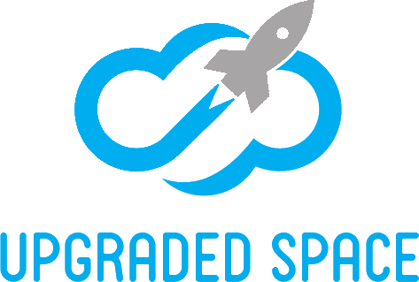

# Upgraded Space

    
      
    
    
    
    
    

**Upgraded Space es una plataforma web diseñada para almacenar tus archivos, acceder a ellos donde quieras y compartirlos con quien quieras.**

## Ejecutar el proyecto

Para ejecutar el proyecto es necesario previamente ejecutar el script SQL que genera la estructura de la base de datos en MySQL. El script se encuentra en el archivo llamado &quot;database.sql&quot;.

## Estructura

Se ha utilizado Twig como motor de plantillas y todas las páginas extienden el archivo &quot;base.html.twig&quot;. Además, hemos hecho uso de _macros_ para evitar repetir código HTML, como el del formulario de registro y actualización del perfil del usuario. Se ha utilizado &quot;doctrine/dbal&quot; para el modelo y se ha seguido el estándar MVC en todo momento.

Como punto opcional, destaca el uso de la librería Bootstrap, de la que hemos utilizado sus componentes para conseguir una interfaz más profesional.

## Landing page

Cuando entramos en la plataforma sin haber iniciado sesión vemos la Landing Page. En esta hemos introducido un slider, información para convencer al usuario, la información de contacto y algunas animaciones usando librerías de Javascript como animate.js, wow.js o progressbar.js para crear una página más atractiva. En la barra de navegación superior el usuario puede elegir si ir a &quot;Iniciar sesión&quot; o &quot;Registrarse&quot;. El usuario sólo puede acceder a la Landing si no ha iniciado sesión.

## Registro

En el registro el usuario debe introducir un nombre de usuario alfanumérico, una dirección de correo electrónico, la fecha de nacimiento, una contraseña y confirmar esa contraseña. Además, el usuario puede subir una imagen de perfil. Si no lo hace, se le adjudicará una por defecto. A medida que el usuario va rellenando los campos, estos van comprobando que el formato sea el correcto y en caso de no serlo, el campo se marca en rojo y aparece un pequeño mensaje de error. Cuando el usuario hace click en &quot;Crear la cuenta&quot; el front-end comprueba que todos los campos tengan el formato correcto y lo envía al back-end, el cual lo vuelve a revisar. Si todo está correcto, se guarda la información y la contraseña se encripta usando _bcrypt_, que es una función de _hash_ específicamente pensada para contraseñas. El motivo de que esta función sea adecuada para contraseñas es que es más lenta en ejecutarse (tarda unos 100ms) respecto otro algoritmos como _sha1_. Esto significa que si un hacker quisiera comparar una contraseña encriptada con este método con una lista de un billón de contraseñas tendría que comprar unas 30.000 horas de CPU para solamente tener la posibilidad de descubrir una contraseña. Para evitar el método de las _rainbow tables_, _bcrypt_ incorpora una _salt_ para cada usuario, que se almacena en el mismo _string_ que contiene el _hash_, es decir, en la misma columna de la tabla de la base de datos. Para obtener más información sobre este tema, se puede consultar el siguiente artículo:

[http://dustwell.com/how-to-handle-passwords-bcrypt.html](http://dustwell.com/how-to-handle-passwords-bcrypt.html)

Al registrarse, se crea una carpeta del usuario en el servidor, se envía un correo al correo electrónico del usuario con el link de activación (que inicia la sesión automáticamente pero es de un único uso) y se redirige a la página de Iniciar sesión donde aparece un mensaje _Flash_ informando que se ha registrado el usuario correctamente. Si el usuario intentase acceder a la página de registro habiendo iniciado sesión, se le redirigiría a su dashboard. Si el usuario aún no ha activado su cuenta mediante el link enviado a su email, aparece un aviso en la sección de &quot;Mi perfil&quot;, con la posibilidad de reenviar el link de activación. Tanto la acción de activar la cuenta como la de reenviar el link de activación están controladas por _middlewares_ para que sólo puedan realizarse si la cuenta no está activada aún.

Para el envío de emails hemos utilizado la librería _swiftmailer_ y para la recepción de los emails en el entorno de desarrollo hemos hecho uso del servicio de [https://mailtrap.io/](https://mailtrap.io/).

## Iniciar sesión

Cuando el usuario está en la página de Login, éste puede introducir el correo o el nombre de usuario en el primer campo y la contraseña en el segundo. La comprobación de front-end y back-end funciona de la misma forma que el registro. Si todo es correcto, el controlador recupera el usuario con ese nombre o correo y comprueba la contraseña. Si las credenciales son correctas, se guarda el identificador del usuario en la sesión y se redirige al Dashboard. Si el usuario intentase acceder a la página de login habiendo iniciado sesión, se le redigiría a su dashboard.

## Editar información de usuario

Cuando el usuario ha iniciado sesión, puede acceder a &quot;Mi perfil&quot;&#39; a través del desplegable de la barra superior. En esta página el usuario verá un formulario parecido al de registro donde se mostrará la información guardada en ese momento. De este formulario se podrá editar el email, la contraseña y la imagen de perfil (si sube una nueva se elimina la anterior, tal como especifica el punto opcional del enunciado). Para poder guardar estos cambios el usuario debe introducir y confirmar una contraseña. Una vez validados por el front-end de la misma forma que en el registro, se envía la información a través de AJAX. El back-end también validará esta información y la actualizará en la base de datos. Tanto si la información se actualiza correctamente como si se ha producido algún error, el servidor avisará al usuario cuando haya terminado a través de un modal. Si el usuario intentase acceder a la página de &quot;Mi perfil&quot; sin haber iniciado sesión, se le redirigiría hacia una página de error 403.

## Eliminar cuenta

En la misma página de &quot;Mi perfil&quot;, el usuario tiene la opción de eliminar su cuenta haciendo click en el botón rojo inferior derecho. Al hacer click, un modal avisará al usuario para que éste confirme que quiere borrar su cuenta. Al aceptar se eliminará de la base de datos toda la información del usuario, así como sus carpetas, archivos, carpetas compartidas y notificaciones. En el servidor se borrará la carpeta de ese usuario, eliminando así los archivos de su interior. Una vez eliminada la cuenta, se redirige a la Landing Page.

## Roles

Existen tres roles: propietario, lector y administrador. El concepto de rol se entiende teniendo en cuenta la relación entre un usuario y una carpeta, es decir, el rol del usuario se calcula según la relación que tiene con esa carpeta. El rol de propietario es para las carpetas que el usuario ha creado, en cambio, los roles de lector y administrador son para ser asignados en el momento de compartir una carpeta con otro usuario.

- **Rol de propietario**. El usuario tiene todos los permisos sobre la carpeta: puede compartirla, ver su contenido, descargar sus archivos, renombrarlos, eliminarlos, crear nuevas carpetas y subir nuevos archivos.
- **Rol de lector**. El usuario que recibe la carpeta compartida solo puede ver los archivos y carpetas y descargar los archivos. El usuario no puede compartir la carpeta.
- **Rol de administrador**. El usuario que recibe la carpeta compartida puede ver, descargar, renombrar, eliminar, crear nuevas carpetas y subir archivos. El usuario no puede compartir la carpeta.

El rol funciona también para los subdirectorios, es decir, si un usuario es asignado como lector, es también lector de todos los subdirectorios (y subdirectorios de subdirectorios, recursivamente) de la carpeta compartida. La misma idea se aplica para el rol de administrador.

Para los casos en los que se comparte una carpeta con un usuario y también se comparte con el mismo usuario una subcarpeta con un rol diferente, el código que se ha programado es capaz de detectar el rol de la carpeta compartida más cercana en el árbol. Esto hace posible que un usuario pueda compartir una carpeta con otro usuario eligiendo el rol de lector y también compartir una carpeta interna con rol de administrador, permitiendo así que el usuario que recibe la carpeta sea administrador de una de las subcarpetas pero sólo sea lector de las demás. Esta funcionalidad abre posibilidades muy interesantes para los usuarios ya que les permite tener más control sobre los permisos que tienen sobre sus carpetas.

El código que calcula el rol que tiene el usuario sobre una carpeta se encuentra en la clase RoleCalculator, que está en la carpeta &quot;utils&quot; de &quot;Controller&quot;. El motivo de situar este código en una clase separada es que permite reutilizar la función en varias partes del proyecto, consiguiendo así que el código sea más limpio.

Todas las acciones posibles (ver contenidos, descargar archivos, renombrar ítems, eliminar ítems, crear nuevas carpetas y subir archivos) son controladas por middlewares para que sólo aquellos usuarios que tienen el rol necesario puedan hacerlas.

## Dashboard

El dashboard permite al usuario gestionar los archivos y carpetas de su unidad, así como los de las carpetas compartidas. Los ítems de tipo archivo se pueden descargar haciendo click en ellos y las carpetas se pueden abrir haciendo doble click en su nombre, ya que hemos implementado la funcionalidad opcional del doble click. Además, el dashboard muestra el rol que tiene el usuario para la carpeta que está viendo su contenido.

Otro añadido extra que hemos implementado es el _breadcrumb_ (en español, miga de pan), que muestra la ruta de carpetas. El inicio del breadcrumb es la raíz (el _root_) para el caso de carpetas de las que el usuario es propietario (es decir, aquellas que ha creado el mismo usuario). Para el caso de carpetas compartidas, el inicio del breadcrumb es la raíz de la carpeta compartida, es decir, aquella que se ha compartido.

## Carpetas

Las carpetas son mostradas en el dashboard y, si el usuario tiene el rol de propietario o de administrador, se pueden crear, renombrar, compartir (sólo si el usuario tiene el rol de propietario) o eliminar. Para saber más detalles sobre las posibilidades que ofrece cada rol, puede consultarse la explicación realizada en el apartado de roles.

Si una carpeta tiene contenido, al eliminarse se elimina también todo su contenido, de forma recursiva, tal como especifica el punto opcional del enunciado.

## Archivos

Los archivos son mostrados en el dashboard y, si el usuario tiene el rol de propietario o de administrador, se pueden subir, renombrar o eliminar. Para saber más detalles sobre las posibilidades que ofrece cada rol, puede consultarse la explicación realizada en el apartado de roles.

Las extensiones de archivo permitidas son PDF, JPG, PNG, GIF, MD y TXT. El tamaño máximo de cada archivo es de 2 MB. El formulario para subir archivos permite seleccionar o arrastrar y soltar múltiples archivos. Es importante destacar que la subida de cada archivo se trata de forma independiente, es decir, si la subida de uno o varios archivos falla, el resto de archivos pueden ser subidos correctamente de igual manera. Para cada archivo subido correctamente y para cada error ocurrido se muestra un mensaje en el dashboard.

## Compartir

El usuario puede compartir aquellas carpetas de las cuales es propietario, es decir, aquellas carpetas que ha creado el mismo usuario y por tanto su rol es _owner_. Para compartir una carpeta, el usuario debe acceder a ella hacer click en el botón &quot;Compartir&quot; (este botón no aparece en la carpeta _root_ porque ésta no se puede compartir). El modal contiene un pequeño formulario en el que se debe especificar el correo electrónico del usuario que va a recibir la carpeta y su rol. Si el email introducido no está asociado a ningún usuario existente en la base de datos o la carpeta ya ha sido compartida previamente con el mismo usuario, se muestra un error. Existen dos roles posibles para compartir una carpeta, tal como se ha explicado en el apartado del bloque de roles.

Tras haber recibido la carpeta, el usuario puede acceder a ella desde el apartado &quot;Compartido conmigo&quot;, donde están todas las carpetas que se han compartido con el usuario, junto con toda la información relacionada. El usuario puede hacer click en &quot;Abrir carpeta&quot; para ver el contenido de la carpeta compartida.

Tanto la acción de compartir una carpeta como las acciones de administrador (ver, descargar, renombrar, eliminar, crear nuevas carpetas y subir archivos) son controladas por middlewares:

- La petición de compartir una carpeta sólo se permite si el usuario es owner de la carpeta.
- Las peticiones de acciones de administrador (ver, descargar, renombrar, eliminar, crear nuevas carpetas y subir archivos) sólo se permiten si el rol del usuario es administrador.

## Almacenamiento

El almacenamiento utilizado por el usuario se calcula mediante la suma de los tamaños de los archivos que tiene, ya que la tabla de archivos en la base de datos existe una columna que es el tamaño que ocupa cada archivo. Además, como añadido extra hemos implementado la funcionalidad de ver el tamaño que ocupa cada carpeta en el dashboard, mostrándose en la columna &quot;Tamaño&quot;. Para conseguir esta funcionalidad hemos utilizado una consulta recursiva a la base de datos, que es capaz de calcular el tamaño total de una carpeta teniendo en cuenta todos sus hijos de forma recursiva. La suma del tamaño de los ítems que se muestran en el dashboard se muestra en la zona inferior, por ejemplo &quot;4 carpetas y 1 archivos, 42952 bytes en total&quot;.

El usuario puede consultar en todo momento el almacenamiento que tiene disponible en el botón desplegable del perfil en la barra principal superior (por ejemplo &quot;525,62 MB disponibles de un total de 1000 MB&quot;). Para hacer posible que el cálculo del espacio disponible esté en todas las vistas (ya que siempre está presente en la barra superior), se llama a la función que correspondiente desde &quot;dependencies.php&quot;, consiguiendo así que sea una variable global para la vista y que el código sea más limpio ya que de lo contrario tendríamos que llamar a la función en todos los controladores.

Al subir archivos, se comprueba si el usuario tiene espacio disponible suficiente teniendo en cuenta el tamaño del archivo que se quiere subir. En caso de que el usuario haya seleccionado varios archivos y alguno(s) de ellos tenga(n) un tamaño superior al espacio disponible, se subirán aquellos que sí que quepan en el espacio disponible y para aquellos que no quepan se mostrará un mensaje de error informativo.

## Notificaciones

Existen 6 tipos de notificaciones:

- **Tipo &quot;folder\_sended&quot;**. Esta notificación se genera cuando un usuario comparte una carpeta con otro usuario. Esta notificación sólo la recibe el usuario que comparte la carpeta. El mensaje de esta notificación incluye el nombre de usuario y el email del usuario que recibe la carpeta, el nombre de la carpeta y el rol asignado.

  * Ejemplo:_Compartiste la carpeta llamada &quot;memes&quot; con cristian-g (hola@cristiangonzalez.com) con rol de lector._

- **Tipo &quot;upload\_renamed&quot;**. Esta notificación se genera cuando un usuario con rol de administrador cambia el nombre de un ítem (carpeta o archivo) que está dentro de una carpeta que ha recibido de otro usuario como carpeta compartida. Esta notificación sólo la recibe el usuario propietario de la carpeta compartida. El mensaje de esta notificación incluye el nombre anterior, el nuevo nombre, el nombre de usuario y el email del usuario que ha realizado la acción, el rol asignado y el nombre de la carpeta compartida.

  * Ejemplo:_La carpeta con el anterior nombre &quot;UpgradedSpace&quot; ha sido renombrada a &quot;UpgradedSpace\_entregada&quot; por paunonell (pau@gmail.com), que es administrador de tu carpeta compartida llamada &quot;Projectes Web&quot;._

- **Tipo &quot;upload\_deleted&quot;**. Esta notificación se genera cuando un usuario con rol de administrador elimina una carpeta o un archivo dentro de una carpeta que ha recibido de otro usuario como carpeta compartida. Esta notificación sólo la recibe el usuario propietario de la carpeta compartida. El mensaje de esta notificación incluye el nombre del ítem eliminado, el nombre de usuario y el email del usuario que ha realizado la acción, el rol asignado y el nombre de la carpeta compartida.

  * Ejemplo:_La carpeta con el nombre &quot;PensamentICreativitat&quot; ha sido eliminada por paunonell (pau@gmail.com), que es administrador de tu carpeta compartida llamada &quot;utilidades&quot;._

- **Tipo &quot;new\_upload&quot;**. Esta notificación se genera cuando un usuario con rol de administrador crea una carpeta o sube un archivo dentro de una carpeta que ha recibido de otro usuario como carpeta compartida. Esta notificación sólo la recibe el usuario propietario de la carpeta compartida. El mensaje de esta notificación incluye el nombre del ítem creado o subido, el nombre de usuario y el email del usuario que ha realizado la acción, el rol asignado y el nombre de la carpeta compartida.

  * Ejemplo:_La carpeta con el nombre &quot;lifeSavers&quot; ha sido creada por marccastells (marc@gmail.com), que es administrador de tu carpeta compartida llamada &quot;frontendAlsoMatters&quot;._

- **Tipo &quot;new\_uploads&quot;**. Esta notificación se genera cuando un usuario con rol de administrador sube múltiples archivos dentro de una carpeta que ha recibido de otro usuario como carpeta compartida. Esta notificación sólo la recibe el usuario propietario de la carpeta compartida. El mensaje de esta notificación incluye el nombre de los archivos subidos, el nombre de usuario y el email del usuario que ha realizado la acción, el rol asignado y el nombre de la carpeta compartida.

  * Ejemplo:_Se han subido 2 nuevos archivos (resetcss.txt, htmltemplate.txt) por marccastells (marc@gmail.com), que es administrador de tu carpeta compartida llamada &quot;frontendAlsoMatters&quot;._

- **Tipo &quot;folder\_received&quot;**. Esta notificación se genera cuando un usuario recibe una carpeta compartida de otro usuario. Esta notificación sólo la recibe el usuario que recibe la carpeta compartida. El mensaje de esta notificación incluye el nombre de usuario y el email del usuario que comparte la carpeta, el nombre de la carpeta y el rol asignado.

  * Ejemplo:_cristian-g (hola@cristiangonzalez.com)_ compartió la carpeta llamada &quot;UpgradedSpaceROCKS&quot; contigo con rol de administrador.

Las notificaciones llegan al usuario de dos maneras diferentes:

- Mediante el apartado &quot;notificaciones&quot;. Existe un widget en la barra principal superior con un icono de una campana que al desplegarse muestra las 5 últimas notificaciones. Al hacer click en &quot;Ver todo&quot; se puede leer un listado completo de todas las notificaciones recibidas.
- Mediante correo electrónico. Para este caso también hemos utilizado la librería _swiftmailer_ para el envío de emails y para la recepción de los mismos en el entorno de desarrollo hemos hecho uso del servicio de [https://mailtrap.io/](https://mailtrap.io/).

Todas las fechas mostradas son relativas (por ejemplo, &quot;hace 10 minutos&quot;) para facilitar que el usuario pueda saber cuándo realizó la acción.

## Diseño de la base de datos

La base de datos está definida en 4 tablas.

La primera tabla es la &quot;user&quot;.Ésta guarda los usuarios registrados en la plataforma y su información. De esta tabla destacamos la columna &quot;uuid&quot;, el cual es un identificador con 32 dígitos hexadecimales que sirve para evitar mostrar información de cuántos usuarios hay en la plataforma y aportar mayor protección. Además usamos la columna &quot;default\_picture&quot; para guardar si estamos usando la foto de perfil por defecto o no y la columna &quot;extension&quot; para guardar en qué extensión se ha guardado la imagen de perfil.

La segunda tabla es la &quot;upload&quot;. En esta tabla guardamos todos los archivos y carpetas y su información que guardan los usuarios en la plataforma, así como el id del usuario que lo ha creado. Aquí también usamos un &quot;uuid&quot; para cada fila. También destacar que en la columna &quot;id\_parent&quot; guardamos el id de la carpeta dentro de la cual está el archivo o carpeta que se ha creado. En caso de estar en _root_ este valor será _null_.

La tercera tabla es la &quot;share&quot;. En esta tabla guardamos la información de las carpetas compartidas por los usuarios con otros usuarios. Destacamos la columna &quot;role&quot;, donde guardamos el rol con el que se ha compartido la carpeta (&quot;reader&quot; o &quot;admin&quot;).

La última tabla es la &quot;notification&quot;. Esta tabla guarda la información de las notificaciones que se mostrarán a los usuarios. En la columna &quot;type&quot; definimos el tipo de notificación, que puede ser &quot;folder\_sended&quot;, &quot;upload\_renamed&quot;, &quot;upload\_deleted&quot;, &quot;new\_upload&quot;, &quot;new\_uploads&quot; o  &quot;folder\_received&quot;.

**El código SQL que genera la estructura de la base de datos en MySQL se encuentra en el archivo llamado &quot;database.sql&quot;.**
